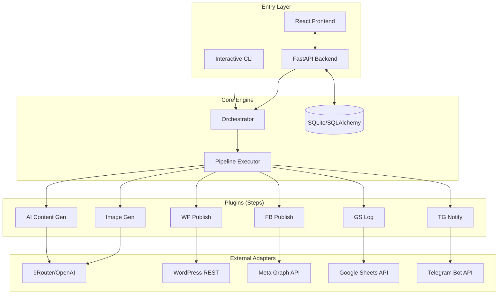

# Blog Autogen

[](https://www.python.org/downloads/)
[](https://fastapi.tiangolo.com/)
[](https://react.dev/)
[](https://opensource.org/licenses/MIT)

**Blog Autogen** is an enterprise-grade AI content engine designed to automate the entire lifecycle of digital storytelling. From initial synthesis and image generation to multi-platform publishing and business auditing, it provides a robust "Core-Plugin" pipeline to scale content production with precision.

---

## 📋 Table of Contents
- [🚀 Key Features](#-key-features)
- [🏗 Architecture](#-architecture)
- [🛠 Strategic Analysis](#-strategic-analysis)
- [📦 Getting Started](#-getting-started)
- [🖱 One-Click Install For Non-Technical Users](#-one-click-install-for-non-technical-users)
- [📦 Packaging Releases](#-packaging-releases)
- [⚙️ Configuration](#️-configuration)
- [📖 Usage Guide](#-usage-guide)
- [🔧 Troubleshooting](#-troubleshooting)
- [🗺 Roadmap](#-roadmap)
- [🧪 Development & Testing](#-development--testing)

---

## 🚀 Key Features

### 🤖 AI-Powered Synthesis
- **Dynamic Storytelling:** Generates high-engagement articles and stories based on raw prompts or crawled URLs.
- **Visual Intelligence:** Automated prompt engineering for high-quality image generation (DALL-E/Midjourney style).
- **Social Optimization:** Creates kịch tính (dramatic) captions specifically optimized for Facebook click-through rates.

### 🛠 Modular "Plugin-First" Architecture
- **Flexible Pipeline:** Enable or disable steps (Image Gen, Facebook, WordPress) on the fly.
- **Atomicity:** Each step is independent. A failure in social posting won't roll back a successful WordPress publication.
- **Extensible:** Easily add new publishing adapters (e.g., LinkedIn, Twitter, Medium) by implementing the `BaseStep` interface.

### 🏢 Multi-Account & Multi-Platform
- **WordPress Integration:** Full support for WordPress REST API including media uploads and category management.
- **Facebook Pages:** Automated posting to multiple Facebook pages with custom captioning and image support.
- **Centralized Management:** A modern Web UI to manage multiple accounts, API keys, and job statuses.

### 📊 Business Auditing & Alerts
- **Google Sheets Integration:** Live reporting of every published post (Title, URL, Status, Timestamp) for easy performance tracking.
- **Telegram Notifications:** Real-time alerts sent to your Telegram Bot after each job completion.

---

## 🏗 Architecture

The project follows a clean separation of concerns:

- **Entry Layer:** Supports both an interactive CLI and a FastAPI-powered Web UI.
- **Application Services:** Coordinates database models (SQLAlchemy) and execution logic.
- **Orchestrator:** Manages state, thread-safe concurrency, and the normalized injection of adapters.
- **Pipeline Core:** A sequential runner that executes registered plugins (`core/pipeline/steps/`).
- **Adapter Layer:** Isolates external dependencies (AI Models, Social APIs, Storage) from the business logic.

### System Architecture Flow



---

## 🛠 Strategic Analysis

### 💪 Strengths
- **High Throughput:** Native multithreading support allows processing hundreds of stories simultaneously.
- **Resilience:** Built-in error handling ensures that one failed API call doesn't stop the entire batch.
- **Hybrid Interface:** Power users can use the CLI for batch automation, while managers use the Web UI for configuration.
- **Clean Codebase:** Type-hinted Python 3 and a modern React 19 frontend with Tailwind CSS 4.

### ⚠️ Considerations (Weaknesses)
- **Configuration Overhead:** Requires several external API integrations (9Router, WordPress, Meta Graph API, Google Cloud, Telegram).
- **Dependency on LLMs:** Quality is highly dependent on the prompt engineering and the stability of the chosen AI provider.
- **Infrastructure:** Requires a stable Python environment and modern Node.js for development builds.

---

## 📦 Getting Started

### Prerequisites
- **Python:** 3.9 or higher
- **Node.js:** 20.19+ or 22.12+ for development/building the Web UI
- **API Keys:** 9Router or compatible AI provider, plus any publishing integrations you plan to use.

### Quick Setup

#### macOS / Linux
```bash
# Clone and run setup
chmod +x packaging/legacy/setup.sh && ./packaging/legacy/setup.sh

# Link the runner (Optional)
sudo ln -sf $(pwd)/blog-autogen-runner /usr/local/bin/blog-autogen
```

#### Windows
```powershell
.\packaging\legacy\setup.bat
```

### Configuration
Run the tool for the first time to launch the interactive onboarding wizard:
```bash
blog-autogen --update
```

---

## 🖱 One-Click Install For Non-Technical Users

For non-technical users, do not ask them to run Node.js or development commands. Build a release zip and send it to them.

### Windows User Flow

Give the user:

```text
StoryAutogen-Windows.zip
```

They should:

1. Extract the zip.
2. Double-click `install_windows.bat` once.
3. Double-click `run.bat` whenever they want to use the tool.
4. Keep the black terminal window open.
5. Use the dashboard at `http://127.0.0.1:8000`.

Requirements on the user's Windows machine:

- Windows 10 or Windows 11.
- Python 3.9+.
- Browser.
- Internet connection for first install.

### macOS User Flow

Give the user:

```text
StoryAutogen-Mac.zip
```

They should:

1. Extract the zip.
2. Right-click `install_mac.command`, then click `Open`.
3. Right-click `run_mac.command`, then click `Open`.
4. Keep the Terminal window open.
5. Use the dashboard at `http://127.0.0.1:8000`.

Requirements on the user's Mac:

- macOS.
- Python 3.9+.
- Browser.
- Internet connection for first install.

Full details are in:

```text
packaging/PACKAGING_GUIDE.md
```

---

## 📦 Packaging Releases

The release packages include a prebuilt frontend served by FastAPI from:

```text
frontend/dist
```

The user does not need Node.js.

### Build Windows Release

On a build machine with Node 20.19+ or 22.12+:

```bash
./packaging/build_windows_release.command
```

Output:

```text
release/StoryAutogen-Windows.zip
```

### Build macOS Release

On a build machine with Node 20.19+ or 22.12+:

```bash
./packaging/build_mac_release.command
```

Output:

```text
release/StoryAutogen-Mac.zip
```

The detailed packaging checklist is in:

```text
packaging/PACKAGING_GUIDE.md
```

---

## ⚙️ Configuration Details

The legacy CLI uses a `config.yaml` file. The Web UI stores accounts, pipelines, and job history in local SQLite.

Local Web UI database:

```text
var/story_autogen.db
```

Key integration groups include:

| Group | Key Fields | Description |
|-------|------------|-------------|
| **AI (9Router)** | `api_key`, `base_url`, `model` | Used for story generation and captioning. |
| **WordPress** | `url`, `username`, `app_password` | Requires "Application Password" for REST API access. |
| **Facebook** | `page_id`, `access_token` | Meta Graph API credentials for page posting. |
| **Google Sheets** | `spreadsheet_id`, `credentials_json` | Service account JSON required for logging. |
| **Telegram** | `bot_token`, `chat_id` | Used for real-time status notifications. |

---

## 📖 Usage Guide

### Mode A: High-Performance CLI
Ideal for batch processing from a `prompts.txt` file.
```bash
# Run with 10 stories and 5 parallel threads
blog-autogen --limit 10 --threads 5

# Process a specific article by URL
blog-autogen --crawl-url "https://example.com/article"
```

### Mode B: Modern Web UI
Ideal for managing accounts and monitoring job progress visually.
```bash
# Start both Backend and Frontend in development
./dev.sh
```
- **Backend:** `http://localhost:8000`
- **Frontend:** `http://localhost:5173`

### Mode C: Packaged Local Web App
Ideal for non-technical users.

```text
run.bat              Windows
run_mac.command      macOS
```

The packaged dashboard opens at:

```text
http://127.0.0.1:8000
```

---

## 🔧 Troubleshooting

### 1. WordPress "Unauthorized" Error
- **Cause:** Incorrect username or Application Password.
- **Fix:** Ensure you are using a generated **Application Password** (WP Admin > Users > Profile), not your login password.

### 2. Facebook Post Failure
- **Cause:** Expired Page Access Token or insufficient permissions.
- **Fix:** Use the Meta for Developers "Graph API Explorer" to generate a Page Access Token with `pages_manage_posts` and `pages_read_engagement` permissions.

### 3. Google Sheets "Permission Denied"
- **Cause:** Service account email not invited to the spreadsheet.
- **Fix:** Open your Google Sheet, click **Share**, and add the service account email found in your credentials JSON as an **Editor**.

### 4. Frontend Build Fails
- **Cause:** Node.js is too old.
- **Fix:** Use Node 20.19+ or 22.12+. This repo includes `.nvmrc`.

### 5. Windows Cannot Find Python
- **Cause:** Python is missing or was installed without PATH.
- **Fix:** Install Python 3.9+ and tick **Add Python to PATH**.

### 6. macOS Blocks `.command` Files
- **Cause:** Gatekeeper blocks downloaded command files.
- **Fix:** Right-click the command file, click **Open**, then confirm.

---

## 🗺 Roadmap
- [ ] **Multi-Language Support:** Expand beyond English and Vietnamese.
- [ ] **Scheduler Integration:** Native cron-style job scheduling within the Web UI.
- [ ] **Advanced Video Prompts:** Generate prompts for video creation tools (Runway/Luma).
- [ ] **New Adapters:** Support for LinkedIn, Medium, and Ghost CMS.

---

## 🧪 Development & Testing

Contributions are welcome! To set up the development environment:
```bash
pip install -e ".[dev]"
pytest
```

Frontend type check:

```bash
cd frontend
./node_modules/.bin/tsc --noEmit
```

Frontend build:

```bash
cd frontend
npm run build
```

---
*Built with precision for the modern content era.*
